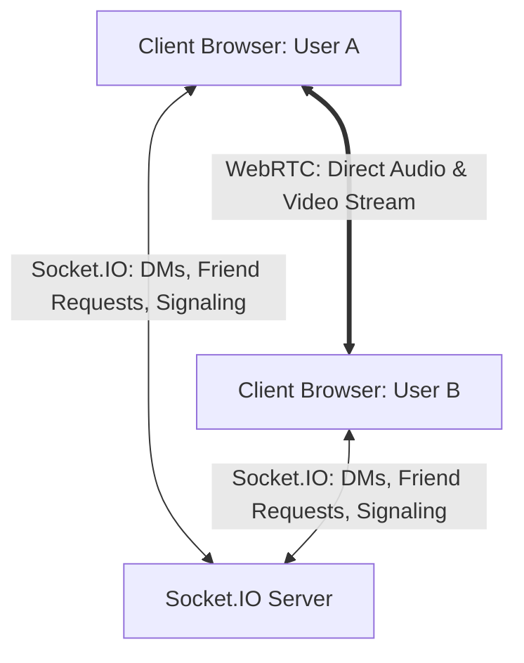
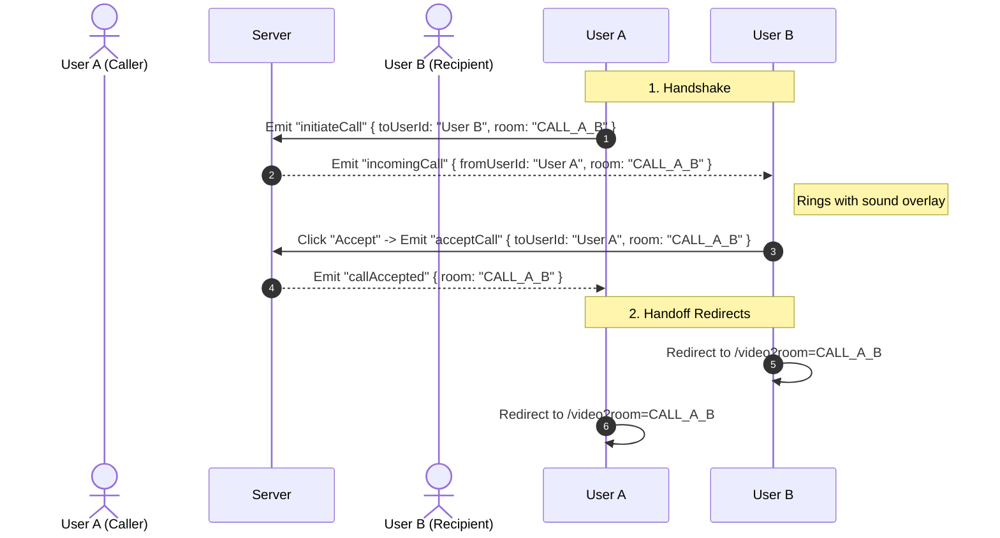

# Developer Guide: Integrating Video Calling, Direct Messaging & Friend Management in AuraCall

This guide serves as a comprehensive developer reference and tutorial outlining the architecture, codebase updates, data flow, and hands-on practice problems for the **AuraCall** real-time workspace.

---

## 🗺️ System Overview & Architecture

AuraCall combines real-time **WebSockets (via Socket.IO)** for instant messaging, status updates, and call handshakes, with **WebRTC** for high-quality, peer-to-peer (P2P) audio/video communications.



1. **Active Sockets Mesh**: A single persistent WebSocket connection is maintained using the `getSocket()` singleton. This connection authenticates using the active user's ID stored in `localStorage` under `auracall_userId`.
2. **WebRTC Peer Negotiation**: Sockets act as the "signaling server" during call initiation. Sockets route the Session Description Protocol (SDP) offers, answers, and ICE (Interactive Connectivity Establishment) candidates between peers.
3. **P2P Audio/Video**: Once the signaling handshake succeeds, video and audio streams flow directly from browser-to-browser with low latency and optimal privacy.

---

## 🛠️ Step-by-Step Implementation Flow

Here is how the features were built from the ground up, linking user identity, friends, direct chats, and calls.

### Step 1: User Identity & Sockets Singleton

- **Identity Storage**: Upon logging in or signing up, the user ID (email prefix or name) is saved in `localStorage` as `auracall_userId`.
- **Connection Handshake**: When the workspace loads, `getSocket()` initializes the socket connection and authenticates the user by passing `{ auth: { userId } }` to the server.
- **Server Registration**: The server registers this mapping (`userId` <-> `socket.id`) in `socket.store.ts` so that it can route direct messages and calls to specific online sockets.

### Step 2: Real-time Friends & Relationship Management

- **The Friends Panel**: Clicking the "Friends & Requests" button on the sidebar opens a manager modal.
- **Outgoing Requests**: Emits `sendFriendRequest` containing `{ toUserId }`. The server stores it in-memory and pushes updates (`friendsDataUpdated`) to both users.
- **Incoming Requests**: Recipient gets a real-time badge count update. Accepting or declining emits `acceptFriendRequest` or `declineFriendRequest`, updating states and online status dots dynamically.

### Step 3: Direct Messaging (DM) Thread

- **Routing**: If the channel param starts with `@` (e.g. `@userB`), the chat layout turns into a DM.
- **Chat Streams**: The page fetches chat history using `getDirectMessageHistory` and registers events:
  - `directMessageReceived`: Appends incoming DMs from the active friend.
  - `directMessageSent`: Confirms and appends sent DMs.
  - `sendDirectMessage`: Emits new messages to the server.

### Step 4: 1-on-1 Call Handshake & Route Redirects

When a user clicks the **Call User** button in a DM thread, the handshake works as follows:



### Step 5: WebRTC Media Streaming

Once redirected to `/video?room=CALL_A_B`:

1. Both browsers query local media devices via `navigator.mediaDevices.getUserMedia()`, routing the stream to the local `<video>` element.
2. The user who was already in the room (initiator) receives the socket event `user-joined`.
3. The initiator instantiates `RTCPeerConnection`, adds local tracks, creates an SDP offer, and sends it to the remote peer.
4. The remote peer receives `offer`, sets the remote description, creates an SDP answer, and sends it back.
5. ICE candidates are relayed dynamically to bridge network routes.
6. Once connected, the remote stream is set on the remote `<video>` tag.

---

## 📂 Core Code Implementations

Below are the key code integrations implemented.

### 1. Client-Side Sockets Singleton (`src/lib/socket.ts`)

Creates and reuses a single connection instance across pages, avoiding duplicate connections.

```typescript
import { io, Socket } from "socket.io-client";

const SOCKET_URL = process.env.NEXT_PUBLIC_API_URL || "http://localhost:3001";
let socket: Socket | null = null;

export function getSocket(userId?: string): Socket {
  if (typeof window === "undefined") return {} as Socket;
  
  const activeUserId = userId || localStorage.getItem("auracall_userId");
  
  if (socket) {
    if (activeUserId && socket.auth && (socket.auth as any).userId !== activeUserId) {
      socket.disconnect();
      socket = null;
    } else {
      if (!socket.connected) socket.connect();
      return socket;
    }
  }

  if (!activeUserId) {
    socket = io(SOCKET_URL, { autoConnect: false });
  } else {
    socket = io(SOCKET_URL, {
      auth: { userId: activeUserId },
      autoConnect: true,
    });
  }
  return socket;
}
```

### 2. Sockets Signaling Hook (`src/app/video/page.tsx` snippet)

This hook registers signaling routes to negotiate WebRTC parameters:

```typescript
useEffect(() => {
  if (!userId) return;
  const socket = getSocket(userId);

  const createPeerConnection = (targetId: string) => {
    const pc = new RTCPeerConnection({
      iceServers: [{ urls: "stun:stun.l.google.com:19302" }]
    });
    peerConnectionRef.current = pc;

    // Attach local stream tracks
    localStreamRef.current?.getTracks().forEach(track => {
      pc.addTrack(track, localStreamRef.current!);
    });

    // Capture remote stream
    pc.ontrack = (event) => {
      if (remoteVideoRef.current && event.streams[0]) {
        remoteVideoRef.current.srcObject = event.streams[0];
        setConnectionStatus("Connected");
      }
    };

    // Forward ICE candidates
    pc.onicecandidate = (event) => {
      if (event.candidate) {
        socket.emit("iceCandidate", { userId: targetId, candidate: event.candidate });
      }
    };
    return pc;
  };

  socket.on("user-joined", async ({ userId: joinedUserId }) => {
    setRemoteUserId(joinedUserId);
    const pc = createPeerConnection(joinedUserId);
    const offer = await pc.createOffer();
    await pc.setLocalDescription(offer);
    socket.emit("offer", { userId: joinedUserId, offer });
  });

  socket.on("offer", async ({ from, offer }) => {
    setRemoteUserId(from);
    const pc = createPeerConnection(from);
    await pc.setRemoteDescription(new RTCSessionDescription(offer));
    const answer = await pc.createAnswer();
    await pc.setLocalDescription(answer);
    socket.emit("answer", { userId: from, answer });
  });

  socket.on("answer", async ({ from, answer }) => {
    await peerConnectionRef.current?.setRemoteDescription(new RTCSessionDescription(answer));
  });

  socket.on("iceCandidate", async ({ from, candidate }) => {
    try {
      await peerConnectionRef.current?.addIceCandidate(new RTCIceCandidate(candidate));
    } catch (e) {
      console.error(e);
    }
  });

  return () => {
    socket.off("user-joined");
    socket.off("offer");
    socket.off("answer");
    socket.off("iceCandidate");
  };
}, [userId, remoteUserId]);
```

---

## 🧪 Testing Verification Flow

To verify that the chat messaging and calling networks work correctly:

1. **Run Servers**:
   - Backend: `cmd.exe /c "npm run dev"` in `/server` (Starts port 3001)
   - Frontend: `cmd.exe /c "npm run dev"` in `/videocall-client` (Starts port 3000)
2. **Simulate Users**:
   - Open Browser 1 (Normal Tab) and log in with email `userA@example.com` (User A).
   - Open Browser 2 (Incognito Window) and log in with email `userB@example.com` (User B).
3. **Verify Friend System**:
   - In User A's panel, add `userB` as a friend.
   - On User B's panel, accept the incoming request. Check that both show a green "Online" dot on the sidebar.
4. **Verify DM Messaging**:
   - Click on the friend in the sidebar list (Navigates to `/chat?room=@userB`).
   - Exchange messages to verify real-time packet delivery.
5. **Verify Call Overlay & Video**:
   - Click the call button on User A's page. Verify User B receives the ringing modal.
   - Click Accept. Both windows should redirect to `/video?room=CALL_userA_userB` and stream webcam feeds.

---

## 🧠 Coding Challenges for Practice

Try to implement these extensions in the codebase to deepen your understanding:

### Problem 1: real-time Global Channel Chat Syncing

* **Problem**: The global chat channels (`#general`, `#random`) are currently static client-side fallbacks. When a user sends a message, other users connected to the same room do not see it in real-time.
- **Goal**: Modify `app/chat/page.tsx` and the socket server so that channel messages are synced across all users joined in that room.
- **Hints**:
  - Look at `server/src/socket/events/rooms.events.ts` to see how users join socket rooms.
  - Listen for a `send_channel_message` event on the server, and use `io.to(roomId).emit("channel_message_received", ...)` to broadcast messages to everyone in the room.

### Problem 2: Call Busy Status

* **Problem**: If User A calls User B while User B is already in a video call with User C, User B's screen will show the incoming call modal, disrupting the active stream.
- **Goal**: Add a server-side state or check to see if a user is currently in a call. If so, automatically emit `callFailed` with an error message `"User is busy"`.
- **Hints**:
  - Maintain an in-memory `activeCalls` set or map on the server containing user IDs currently in rooms starting with `"CALL_"`.
  - Check this status inside the `initiateCall` listener in `friends.events.ts`.

### Problem 3: Screen Share Integration

* **Problem**: During a video call, users can only stream their webcam feeds, and cannot share their screens.
- **Goal**: Add a "Share Screen" button in `app/video/page.tsx` controls dock. Clicking it should replace the video track inside `peerConnectionRef` with the screen capture track.
- **Hints**:
  - Query stream using `navigator.mediaDevices.getDisplayMedia({ video: true })`.
  - Locate the video sender using `peerConnectionRef.current.getSenders().find(s => s.track.kind === 'video')`.
  - Use `sender.replaceTrack(screenTrack)` to transition feeds smoothly.
