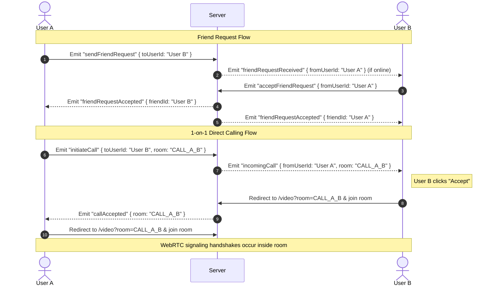

# Implementation Plan: Friend Requests, Direct Messaging & 1-on-1 Video Calling

This plan outlines the architecture and step-by-step development process to implement a real-time communications workspace with Friend Lists, Friend Requests, Direct Messages, and direct WebRTC Video Calling, styled like Discord.

---

## User Review Required

> [!NOTE]
> - **In-Memory Server Persistence**: For this phase, friendship states, friend requests, and direct messaging histories will be maintained in-memory in a server-side store (`friends.store.ts`). This is perfect for local developer testing (User A, User B, User C) and does not require installing external databases.
> - **Call Ringing Overlay**: An incoming call will trigger a global visual overlay/modal containing ring sound animations, allowing the recipient to `Accept` or `Decline` the call from any screen of the workspace.
> - **Seamless Route Handoff**: Accepting a call will automatically redirect both participants to the video calling page `/video?room=CALL_from_to` to execute WebRTC peer signaling.

---

## System Architecture & Sockets Workflow

### 1. Friendship & Call Handshake Sequences



---

## Step-by-Step Proposed Changes

### 1. Server-Side Modules (Socket Server)

#### [NEW] [friends.store.ts](file:///c:/Users/harir/Desktop/videoCalling/server/socket/friends.store.ts)
- Create a store file to manage friendship structures:
  - `friendRequests`: `Array<{ from: string, to: string, status: 'pending' | 'accepted' }>`
  - `friendships`: `Array<{ user1: string, user2: string }>`
  - `directMessages`: `Array<{ from: string, to: string, text: string, timestamp: string }>`
- Expose methods: `sendRequest(from, to)`, `acceptRequest(from, to)`, `getFriends(userId)`, `getPendingRequests(userId)`, `saveDM(from, to, text)`.

#### [NEW] [friends.events.ts](file:///c:/Users/harir/Desktop/videoCalling/server/socket/events/friends.events.ts)
- Implement event endpoints:
  - `socket.on("sendFriendRequest", ({ toUserId }) => { ... })`
  - `socket.on("acceptFriendRequest", ({ fromUserId }) => { ... })`
  - `socket.on("sendDirectMessage", ({ toUserId, text }) => { ... })`
  - `socket.on("initiateCall", ({ toUserId, room }) => { ... })`
  - `socket.on("declineCall", ({ fromUserId }) => { ... })`
- Notify clients in real-time when online status maps change (e.g. emit `userStatusChanged` on connection/disconnection).

#### [MODIFY] [index.ts](file:///c:/Users/harir/Desktop/videoCalling/server/socket/index.ts)
- Register `registerFriendsEvents(socket, io)` inside the `io.on("connection")` initializer block.

---

### 2. Client-Side Modules (Next.js Application)

#### [MODIFY] [workspace-sidebar.tsx](file:///c:/Users/harir/Desktop/videoCalling/videocall-client/src/components/workspace-sidebar.tsx)
- Add a **Direct Messages** section:
  - Lists friends (User A, User B, User C) alongside green (online) or gray (offline) status dots.
  - Lists pending friend request count indicators.
- Add an **Add Friend** panel/inline input to trigger the `sendFriendRequest` socket emission.
- Add a **Pending Requests** drawer or tab modal to view incoming invitations and accept/decline them.

#### [NEW] [incoming-call-modal.tsx](file:///c:/Users/harir/Desktop/videoCalling/videocall-client/src/components/incoming-call-modal.tsx)
- Build a global floating layout element that listens to socket `incomingCall` triggers:
  - Renders a pulsing blue circular phone animation showing the caller's ID.
  - Provides a red `Decline` button and a green `Accept` button.
  - Plays a clean ringing sound effect using standard HTML Audio API (optional, can be disabled).

#### [MODIFY] [chat/page.tsx](file:///c:/Users/harir/Desktop/videoCalling/videocall-client/src/app/chat/page.tsx)
- Check search query params. If `room` starts with `@` or represents a user ID (e.g., `room=@UserB`), adapt layout into a **Direct Messages Thread**:
  - Top header: Shows active DM friend name, online status, and a prominent blue `📞 Call` button.
  - Chat logs: Pulls DM logs instead of global channel logs.
- Add the `IncomingCallModal` to the layout container.

---

## Verification Plan

### Automated Checks
Verify compilation checks of backend and frontend:
```bash
# Verify client build
powershell -ExecutionPolicy Bypass -Command "npm run build"
```

### Manual Visual Tests
1. Open three browser pages side-by-side representing `User A`, `User B`, and `User C`.
2. Send a friend request from `User A` to `User B`. Verify the pending count update on `User B`'s sidebar.
3. Accept the request, and check that both display active online status dots in each other's DMs list.
4. Send a Direct Message chat, and check for real-time delivery.
5. Click the `Call` button on `User A`'s page. Verify that `User B` receives the incoming call modal.
6. Click `Accept` on `User B`'s page. Check that both pages automatically redirect to `/video?room=CALL_A_B` and begin local webcam rendering.
